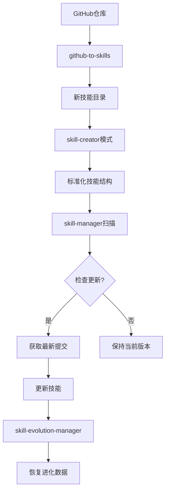
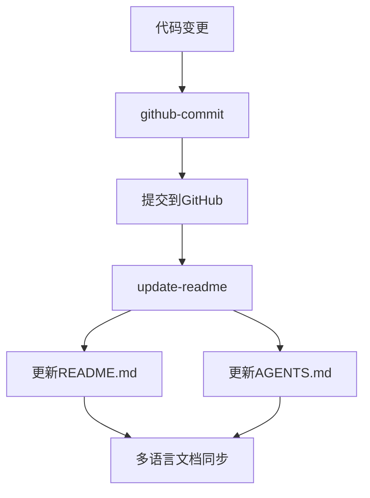
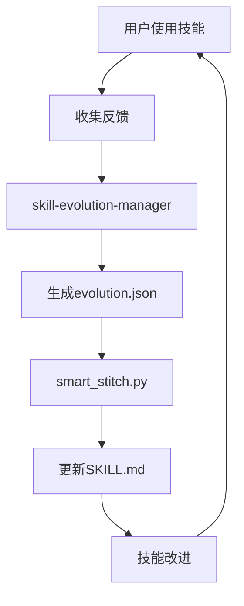

# 技能协同工作指南

## 概述

本文档描述了OpenCode技能库中各个技能之间的协同工作关系和最佳实践。技能不是孤立工作的，它们可以相互调用、共享数据和协同完成复杂任务。

## 技能依赖关系图

```
技能生态系统依赖关系：
┌─────────────────────────────────────────────────────────────┐
│                   技能生命周期管理系统                       │
├───────────────┬───────────────┬─────────────────────────────┤
│  创建阶段     │  维护阶段     │  进化阶段                   │
│  github-to-   │  skill-       │  skill-evolution-          │
│  skills       │  manager      │  manager                   │
└───────┬───────┴───────┬───────┴───────┬─────────────────────┘
        │               │               │
        ▼               ▼               ▼
┌───────────────┐ ┌───────────────┐ ┌─────────────────────┐
│ skill-creator │ │ update-readme │ │ 所有技能的进化数据  │
│ (技能创建模式)│ │ (文档同步)    │ │ (evolution.json)    │
└───────┬───────┘ └───────┬───────┘ └─────────────────────┘
        │                 │
        ▼                 ▼
┌─────────────────────────────────────────────────────────────┐
│                   所有其他技能                               │
│  • paper-detailed-analysis  • humanizer                     │
│  • paper-depth-reading      • humanizer-zh                  │
│  • pdf                      • github-commit                 │
│  • baoyu-url-to-markdown                                    │
└─────────────────────────────────────────────────────────────┘
```

## 核心协同工作流

### 1. 技能创建与维护工作流



### 2. 文档同步工作流



### 3. 技能进化工作流



## 具体协同场景

### 场景1：从GitHub创建新技能并维护

```bash
# 1. 从GitHub创建新技能
python github-to-skills/scripts/fetch_github_info.py https://github.com/username/repo.git

# 2. 使用skill-creator模式标准化技能
python skill-creator/scripts/init_skill.py new-skill --path .

# 3. 添加到skill-manager管理
python skill-manager/scripts/scan_and_check.py .

# 4. 定期检查更新
python skill-manager/scripts/list_skills.py .
```

### 场景2：技能使用后的进化

```bash
# 1. 用户使用技能后收集反馈
# 2. 使用evolution-manager记录经验
python skill-evolution-manager/scripts/merge_evolution.py skill-name '{
  "preferences": ["用户偏好设置"],
  "fixes": ["已知问题修复"],
  "custom_prompts": "自定义提示词"
}'

# 3. 将经验缝合到技能文档
python skill-evolution-manager/scripts/smart_stitch.py skill-name
```

### 场景3：代码变更后的文档同步

```bash
# 1. 提交代码变更
python github-commit/scripts/create_commit.py . "添加新功能"

# 2. 自动更新文档
# (update-readme技能会自动检测git变更并更新文档)
```

## 技能间数据共享

### 1. evolution.json 数据格式

所有技能都可以通过`skill-evolution-manager`共享进化数据：

```json
{
  "last_updated": "2025-01-23T12:00:00",
  "preferences": ["用户偏好1", "用户偏好2"],
  "fixes": ["修复问题1", "修复问题2"],
  "custom_prompts": "自定义指令文本"
}
```

### 2. skill-manager 元数据

`github-to-skills`创建的技能包含以下元数据，供`skill-manager`使用：

```yaml
---
name: skill-name
description: 技能描述
github_url: https://github.com/username/repo.git
github_hash: abc123def456  # 用于版本检查
---
```

### 3. 跨技能配置共享

技能可以通过`references/`目录共享配置和模板：
- `skill-creator/references/` - 技能创建模板
- `update-readme/references/` - 文档模板
- `pdf/references/` - PDF处理参考

## 最佳实践

### 1. 技能创建时
- 始终使用`github-to-skills`从GitHub创建技能
- 遵循`skill-creator`的标准化结构
- 立即添加到`skill-manager`进行版本管理

### 2. 技能维护时
- 定期运行`skill-manager`检查更新
- 使用`update-readme`同步文档变更
- 通过`skill-evolution-manager`记录用户反馈

### 3. 技能进化时
- 每次技能更新后运行`smart_stitch.py`
- 批量对齐所有技能的进化数据
- 保持进化数据的向后兼容性

### 4. 文档管理
- 代码变更后立即更新文档
- 保持多语言文档同步
- 使用标准化模板确保一致性

## 故障排除

### 常见问题1：技能更新后进化数据丢失
**解决方案**：
```bash
# 运行全量对齐工具
python skill-evolution-manager/scripts/align_all.py
```

### 常见问题2：技能依赖关系断裂
**解决方案**：
1. 检查`skill-manager`中的技能列表
2. 验证`github_url`和`github_hash`元数据
3. 重新运行`github-to-skills`获取最新信息

### 常见问题3：文档不同步
**解决方案**：
1. 运行`update-readme`技能
2. 检查git提交历史
3. 手动同步多语言文档

## 扩展协同工作

### 1. 自定义协同脚本
可以在`scripts/`目录中添加协同脚本：

```python
# scripts/skill_synergy.py
import subprocess
import json

def update_all_skills():
    """更新所有技能并同步进化数据"""
    # 1. 检查技能更新
    subprocess.run(["python", "skill-manager/scripts/scan_and_check.py", "."])
    
    # 2. 对齐进化数据
    subprocess.run(["python", "skill-evolution-manager/scripts/align_all.py"])
    
    # 3. 更新文档
    subprocess.run(["python", "update-readme/scripts/analyze_project.py", "."])
```

### 2. 自动化工作流
使用GitHub Actions或类似工具自动化协同工作：

```yaml
# .github/workflows/skill-synergy.yml
name: Skill Synergy
on:
  schedule:
    - cron: '0 0 * * 0'  # 每周日运行
  push:
    branches: [ main ]

jobs:
  sync:
    runs-on: ubuntu-latest
    steps:
      - uses: actions/checkout@v3
      - name: Update skills
        run: python skill-manager/scripts/scan_and_check.py .
      - name: Sync evolution data
        run: python skill-evolution-manager/scripts/align_all.py
      - name: Update documentation
        run: python update-readme/scripts/generate_readme.py .
```

## 总结

OpenCode技能库通过以下方式实现技能协同工作：

1. **标准化结构**：所有技能遵循相同目录结构
2. **元数据共享**：通过YAML frontmatter和evolution.json共享数据
3. **工具链集成**：技能管理工具形成完整生命周期
4. **自动化工作流**：脚本和工具支持自动化协同

通过有效利用这些协同机制，可以构建更强大、更智能的技能生态系统。