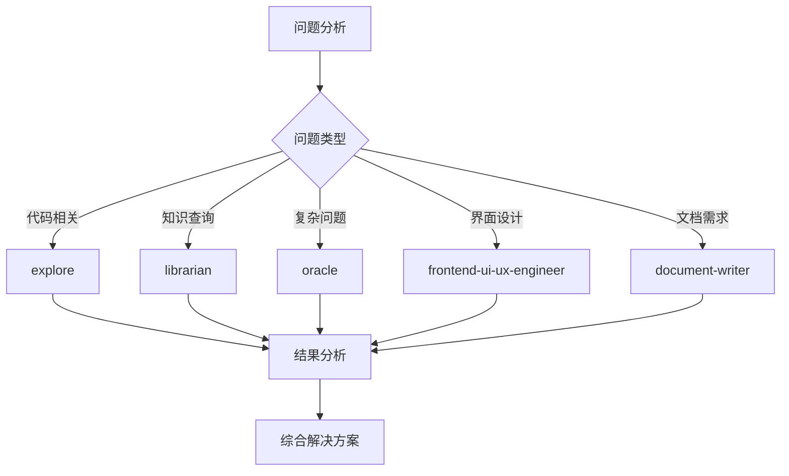

# AI 代理配置文档

## 概述

本文档记录项目中使用的AI代理配置、使用方法和最佳实践。AI代理是专门化的AI助手，用于处理特定类型的任务。

## 可用代理列表

### 核心代理

#### 1. explore - 代码库探索专家
**用途**：快速探索代码库结构、查找模式、分析代码组织
**触发时机**：
- 需要了解项目整体结构时
- 查找特定类型的文件或代码模式
- 分析代码库中的重复模式
- 理解项目架构

**使用示例**：
```bash
# 探索项目结构
/explore "分析项目的目录结构"

# 查找特定模式
/explore "查找所有使用React hooks的组件"

# 分析代码组织
/explore "检查项目的错误处理模式"
```

#### 2. librarian - 文档搜索专家
**用途**：搜索外部文档、库文档、最佳实践
**触发时机**：
- 需要了解第三方库的使用方法
- 查找API文档
- 搜索最佳实践和设计模式
- 解决技术难题

**使用示例**：
```bash
# 搜索库文档
/librarian "查找Express.js中间件的最佳实践"

# 搜索API文档
/librarian "React useEffect的完整API文档"

# 解决技术问题
/librarian "如何优化大型React应用的性能"
```

#### 3. oracle - 架构设计和调试专家
**用途**：复杂问题解决、架构设计、深度调试
**触发时机**：
- 遇到复杂的技术难题
- 需要架构设计建议
- 深度调试和问题分析
- 性能优化建议

**使用示例**：
```bash
# 架构设计
/oracle "设计一个可扩展的微服务架构"

# 问题调试
/oracle "分析这个内存泄漏问题"

# 性能优化
/oracle "优化数据库查询性能"
```

#### 4. frontend-ui-ux-engineer - 前端UI/UX专家
**用途**：前端界面设计、用户体验优化、样式调整
**触发时机**：
- 需要修改界面样式
- 优化用户体验
- 响应式设计调整
- 动画和交互效果

**使用示例**：
```bash
# 界面设计
/frontend-ui-ux-engineer "改进登录页面的用户体验"

# 样式调整
/frontend-ui-ux-engineer "优化移动端响应式布局"

# 动画效果
/frontend-ui-ux-engineer "添加页面过渡动画"
```

#### 5. document-writer - 技术文档编写专家
**用途**：编写技术文档、API文档、用户指南
**触发时机**：
- 需要编写项目文档
- 创建API文档
- 编写用户指南
- 生成技术规范

**使用示例**：
```bash
# 编写文档
/document-writer "为这个API编写使用文档"

# 创建指南
/document-writer "编写项目安装和配置指南"

# 生成规范
/document-writer "创建代码规范文档"
```

### 可选代理

#### 6. multimodal-looker - 多模态内容分析专家
**用途**：分析图像、PDF、图表等多媒体内容
**触发时机**：
- 需要分析图像内容
- 提取PDF文档信息
- 理解图表和数据可视化
- 处理多媒体文件

#### 7. general - 通用任务处理
**用途**：处理通用任务、多步骤工作流
**触发时机**：
- 复杂的多步骤任务
- 需要并行处理的任务
- 通用问题解决

## 配置说明

### 基础配置

#### 环境变量
```env
# 代理配置
AGENT_EXPLORE_ENABLED=true
AGENT_LIBRARIAN_ENABLED=true
AGENT_ORACLE_ENABLED=true
AGENT_FRONTEND_ENABLED=true
AGENT_DOCUMENT_WRITER_ENABLED=true

# 性能配置
AGENT_TIMEOUT=300000  # 5分钟超时
AGENT_MAX_TOKENS=4000
AGENT_TEMPERATURE=0.7
```

#### 配置文件示例 (.agentrc)
```json
{
  "agents": {
    "explore": {
      "enabled": true,
      "timeout": 180000,
      "maxDepth": 3,
      "fileTypes": [".js", ".ts", ".jsx", ".tsx", ".py", ".java"]
    },
    "librarian": {
      "enabled": true,
      "sources": ["official_docs", "stackoverflow", "github", "blogs"],
      "maxResults": 10
    },
    "oracle": {
      "enabled": true,
      "minComplexity": "high",
      "maxResponseTime": 300000
    },
    "frontend-ui-ux-engineer": {
      "enabled": true,
      "frameworks": ["react", "vue", "angular", "svelte"],
      "cssFrameworks": ["tailwind", "bootstrap", "material-ui"]
    },
    "document-writer": {
      "enabled": true,
      "formats": ["markdown", "asciidoc", "restructuredtext"],
      "templates": ["api", "guide", "tutorial", "reference"]
    }
  },
  "global": {
    "logLevel": "info",
    "cacheEnabled": true,
    "cacheTTL": 3600
  }
}
```

### 项目特定配置

#### React 项目配置
```javascript
// agent.config.js
module.exports = {
  agents: {
    'frontend-ui-ux-engineer': {
      priority: 'high',
      frameworks: ['react'],
      libraries: ['material-ui', 'antd', 'chakra-ui']
    },
    'explore': {
      filePatterns: ['**/*.{js,jsx,ts,tsx}'],
      ignorePatterns: ['node_modules/**', 'build/**']
    }
  }
};
```

#### Python 项目配置
```python
# agent_config.py
AGENT_CONFIG = {
    'librarian': {
        'python_version': '3.9',
        'libraries': ['flask', 'django', 'fastapi', 'sqlalchemy']
    },
    'oracle': {
        'architecture_patterns': ['mvc', 'microservices', 'event-driven']
    }
}
```

## 使用示例

### 示例1：代码库探索
**场景**：新加入项目，需要快速了解代码结构

```bash
# 1. 探索整体结构
/explore "显示项目的目录结构和主要模块"

# 2. 查找特定功能
/explore "查找用户认证相关的代码"

# 3. 分析设计模式
/explore "分析项目中使用的设计模式"
```

**预期输出**：
- 项目结构图
- 关键文件位置
- 主要模块说明
- 设计模式分析

### 示例2：技术问题解决
**场景**：遇到性能问题，需要优化

```bash
# 1. 使用librarian搜索最佳实践
/librarian "React应用性能优化最佳实践"

# 2. 使用explore分析当前代码
/explore "查找可能引起性能问题的代码模式"

# 3. 使用oracle制定优化方案
/oracle "基于分析结果，制定性能优化方案"
```

**预期输出**：
- 最佳实践总结
- 问题代码定位
- 优化方案建议
- 实施步骤

### 示例3：文档编写
**场景**：需要为新功能编写文档

```bash
# 1. 使用explore了解功能实现
/explore "分析新功能的代码实现"

# 2. 使用document-writer编写文档
/document-writer "基于代码分析，编写功能使用文档"

# 3. 使用oracle审查文档
/oracle "审查文档的完整性和准确性"
```

**预期输出**：
- 功能分析报告
- 完整的使用文档
- 文档质量评估
- 改进建议

## 最佳实践

### 1. 代理选择指南

#### 何时使用哪个代理
- **简单查询**：直接使用基础工具（read, glob, grep）
- **代码探索**：使用 `explore` 代理
- **外部知识**：使用 `librarian` 代理
- **复杂问题**：使用 `oracle` 代理
- **界面设计**：使用 `frontend-ui-ux-engineer` 代理
- **文档编写**：使用 `document-writer` 代理

#### 代理组合使用


### 2. 性能优化

#### 减少不必要的代理调用
```bash
# 不好：过度使用代理
/explore "查找文件"
/librarian "搜索文档"
/oracle "分析问题"

# 好：针对性使用代理
# 先使用基础工具
read package.json
glob "src/**/*.js"

# 必要时使用代理
/oracle "基于已有信息，分析架构问题"
```

#### 缓存策略
```javascript
// 实现代理结果缓存
const agentCache = new Map();

async function callAgentWithCache(agent, query) {
  const cacheKey = `${agent}:${query}`;
  
  if (agentCache.has(cacheKey)) {
    return agentCache.get(cacheKey);
  }
  
  const result = await callAgent(agent, query);
  agentCache.set(cacheKey, result);
  
  // 设置缓存过期时间
  setTimeout(() => {
    agentCache.delete(cacheKey);
  }, 3600000); // 1小时
  
  return result;
}
```

### 3. 错误处理

#### 代理调用失败处理
```javascript
class AgentService {
  async callAgent(agent, query, options = {}) {
    try {
      // 尝试调用代理
      const result = await this.executeAgentCall(agent, query, options);
      
      // 验证结果
      if (!this.validateResult(result)) {
        throw new Error('Invalid agent response');
      }
      
      return result;
      
    } catch (error) {
      // 记录错误
      this.logError(agent, query, error);
      
      // 根据错误类型采取不同策略
      if (error.type === 'timeout') {
        return this.handleTimeout(agent, query);
      } else if (error.type === 'rate_limit') {
        return this.handleRateLimit(agent, query);
      } else {
        // 回退到基础工具
        return this.fallbackToBasicTools(query);
      }
    }
  }
  
  fallbackToBasicTools(query) {
    // 使用read、glob、grep等基础工具
    // 提供基本的功能
  }
}
```

#### 监控和日志
```yaml
# 监控配置
monitoring:
  agents:
    explore:
      metrics:
        - response_time
        - success_rate
        - cache_hit_rate
      alerts:
        - response_time > 5000ms
        - success_rate < 95%
    
    oracle:
      metrics:
        - complexity_score
        - solution_quality
        - user_satisfaction
```

### 4. 安全考虑

#### 输入验证
```javascript
function validateAgentInput(agent, input) {
  const validationRules = {
    explore: {
      maxLength: 1000,
      allowedPatterns: [/^[a-zA-Z0-9\s\-_.,;:!?()\[\]{}'"\/\\]+$/],
      disallowedPatterns: [/password/i, /secret/i, /key/i]
    },
    librarian: {
      maxLength: 500,
      allowedPatterns: [/^[a-zA-Z0-9\s\-_.,;:!?()\[\]{}'"\/\\]+$/]
    },
    oracle: {
      maxLength: 2000,
      allowedPatterns: [/^[a-zA-Z0-9\s\-_.,;:!?()\[\]{}'"\/\\]+$/]
    }
  };
  
  const rules = validationRules[agent];
  if (!rules) {
    throw new Error(`No validation rules for agent: ${agent}`);
  }
  
  // 检查长度
  if (input.length > rules.maxLength) {
    throw new Error(`Input too long for ${agent}. Max: ${rules.maxLength}`);
  }
  
  // 检查不允许的模式
  for (const pattern of rules.disallowedPatterns || []) {
    if (pattern.test(input)) {
      throw new Error(`Input contains disallowed content for ${agent}`);
    }
  }
  
  return true;
}
```

#### 输出过滤
```javascript
function sanitizeAgentOutput(output) {
  // 移除敏感信息
  const sensitivePatterns = [
    /api[_-]?key=([^&\s]+)/gi,
    /password=([^&\s]+)/gi,
    /secret=([^&\s]+)/gi,
    /token=([^&\s]+)/gi
  ];
  
  let sanitized = output;
  sensitivePatterns.forEach(pattern => {
    sanitized = sanitized.replace(pattern, '[REDACTED]');
  });
  
  return sanitized;
}
```

## 集成示例

### 与CI/CD集成
```yaml
# .github/workflows/agent-review.yml
name: Agent Code Review

on:
  pull_request:
    branches: [main]

jobs:
  agent-review:
    runs-on: ubuntu-latest
    steps:
      - uses: actions/checkout@v3
      
      - name: Run explore agent
        run: |
          /explore "分析PR中的代码变更"
          
      - name: Run oracle for architecture review
        run: |
          /oracle "审查架构变更是否符合最佳实践"
          
      - name: Generate review report
        run: |
          /document-writer "生成代码审查报告"
```

### 与开发工具集成
```json
// .vscode/settings.json
{
  "agent.integration": {
    "explore": {
      "command": "explore",
      "trigger": "onFileOpen",
      "patterns": ["**/*.{js,ts,jsx,tsx,py,java}"]
    },
    "librarian": {
      "command": "librarian",
      "trigger": "onHover",
      "languages": ["javascript", "typescript", "python"]
    }
  }
}
```

## 故障排除

### 常见问题

#### 1. 代理无响应
**症状**：代理调用超时或无响应
**解决方案**：
```bash
# 检查代理状态
agent status

# 重启代理服务
agent restart

# 检查网络连接
ping agent-service
```

#### 2. 结果质量差
**症状**：代理返回的结果不准确或不相关
**解决方案**：
```bash
# 优化查询语句
# 不好：模糊查询
/explore "代码"

# 好：具体查询
/explore "查找用户认证相关的React组件"

# 添加更多上下文
/oracle "在React项目中，如何实现JWT认证？项目使用Redux进行状态管理"
```

#### 3. 性能问题
**症状**：代理响应慢
**解决方案**：
```javascript
// 实现请求批处理
async function batchAgentRequests(requests) {
  const batchedResults = [];
  
  for (const batch of chunkArray(requests, 5)) { // 每批5个请求
    const batchPromises = batch.map(req => 
      callAgent(req.agent, req.query, req.options)
    );
    
    const batchResults = await Promise.all(batchPromises);
    batchedResults.push(...batchResults);
  }
  
  return batchedResults;
}
```

### 调试技巧

#### 启用详细日志
```bash
# 设置日志级别
export AGENT_LOG_LEVEL=debug

# 查看代理日志
tail -f /var/log/agent.log
```

#### 性能分析
```bash
# 监控代理性能
agent monitor --metrics response_time,cpu_usage,memory_usage

# 生成性能报告
agent profile --output report.html
```

## 更新和维护

### 版本管理
```bash
# 检查代理版本
agent --version

# 更新代理
agent update

# 查看更新日志
agent changelog
```

### 配置备份
```bash
# 备份配置
cp .agentrc .agentrc.backup

# 恢复配置
cp .agentrc.backup .agentrc
```

### 定期维护任务
```bash
# 清理缓存
agent cache clear

# 更新知识库
agent knowledge update

# 检查健康状态
agent health check
```

## 贡献指南

### 添加新代理
1. 在 `agents/` 目录创建新代理
2. 更新本文档的"可用代理列表"部分
3. 添加配置示例
4. 编写使用示例
5. 更新集成配置

### 改进现有代理
1. 测试现有功能
2. 实现改进
3. 更新文档
4. 添加测试用例

### 报告问题
1. 描述问题现象
2. 提供复现步骤
3. 包含环境信息
4. 建议解决方案

---

*本文档最后更新于：2025-01-22*  
*维护者：项目团队*  
*版本：1.0.0*