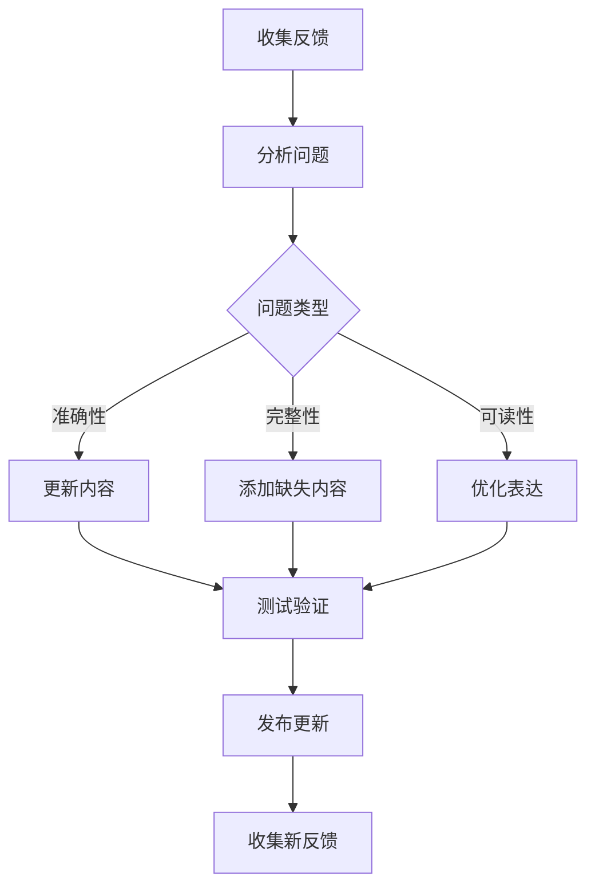

# 文档最佳实践指南

## 概述

本文档提供创建和维护高质量项目文档的最佳实践。遵循这些指南可以确保文档的实用性、准确性和可维护性。

## 核心原则

### 1. 用户中心原则
文档应该以用户为中心，而不是以开发者为中心。

**好：**
```markdown
## 快速开始
只需3步即可运行项目：
1. 安装依赖：`npm install`
2. 启动开发服务器：`npm run dev`
3. 在浏览器中打开：`http://localhost:3000`
```

**不好：**
```markdown
## 项目配置
项目使用Webpack 5进行构建，配置位于webpack.config.js...
```

### 2. 渐进式披露原则
从简单开始，逐步深入。

**文档结构：**
1. **快速开始**：最简单的使用方式
2. **基本使用**：常用功能
3. **高级功能**：复杂特性
4. **API参考**：完整的技术细节

### 3. 一致性原则
在整个文档中保持一致的风格、术语和格式。

## README.md 最佳实践

### 基本结构
每个README.md应该包含以下核心部分：

#### 1. 标题和描述
```markdown
# 项目名称

简短的项目描述（1-2句话），说明项目是什么、解决什么问题。


```

#### 2. 功能特性
使用列表形式，每条特性以动词开头：
```markdown
## 🚀 功能特性
- **快速部署**：一键部署到多种云平台
- **实时监控**：内置性能监控和告警系统
- **可扩展架构**：支持插件系统和自定义模块
- **多语言支持**：支持中文、英文、日文界面
```

#### 3. 快速开始
提供最简单的入门方式：
```markdown
## 📦 快速开始

### 前提条件
- Node.js 16+
- npm 7+ 或 yarn 1.22+

### 安装
```bash
npm install package-name
```

### 基本使用
```javascript
import { functionName } from 'package-name';

const result = functionName(options);
console.log(result);
```
```

#### 4. 详细指南
```markdown
## 📖 详细指南

### 配置
[配置说明...]

### 高级功能
[高级功能说明...]

### 示例
[代码示例...]
```

#### 5. API参考
```markdown
## 🔧 API参考

### 类 `ClassName`
**描述**：类的功能描述

**构造函数**：
```javascript
new ClassName(options)
```

**方法**：
- `methodName(params)`：方法描述
  - `param` (类型)：参数描述
  - **返回值**：类型 - 返回值描述
```

#### 6. 贡献指南
```markdown
## 🤝 贡献

欢迎贡献！请阅读[贡献指南](CONTRIBUTING.md)。

### 开发流程
1. Fork仓库
2. 创建功能分支
3. 提交更改
4. 创建Pull Request
```

#### 7. 许可证
```markdown
## 📄 许可证

本项目基于MIT许可证发布 - 查看[LICENSE](LICENSE)文件了解详情。
```

### 内容质量指南

#### 准确性
- 所有命令和代码示例必须经过测试
- 版本号必须准确
- API描述必须与代码一致

#### 完整性
- 覆盖所有主要功能
- 包含常见问题解答
- 提供故障排除指南

#### 可读性
- 使用清晰的标题结构
- 适当的代码块和语法高亮
- 使用列表和表格提高可读性

#### 时效性
- 定期更新文档
- 标记过时内容
- 提供迁移指南

### 格式规范

#### 标题层级
```markdown
# 一级标题（项目名称）
## 二级标题（主要章节）
### 三级标题（子章节）
#### 四级标题（更细的划分）
```

#### 代码块
```markdown
```bash
# Shell命令
npm install
```

```javascript
// JavaScript代码
const value = 42;
```

```python
# Python代码
def function():
    return True
```
```

#### 链接和引用
```markdown
[链接文本](URL)


> 引用内容
```

#### 列表
```markdown
- 无序列表项
- 另一个列表项

1. 有序列表项
2. 另一个有序项
```

## AGENTS.md 最佳实践

### 文档目的
AGENTS.md专门记录AI代理的配置和使用，帮助团队成员有效利用AI辅助工具。

### 核心内容

#### 1. 代理概述
```markdown
# AI代理配置

## 概述
本文档记录项目中使用的AI代理配置和使用方法。

## 可用代理
| 代理名称 | 用途 | 触发时机 |
|---------|------|----------|
| explore | 代码库探索 | 需要了解项目结构时 |
| librarian | 文档搜索 | 需要外部知识时 |
| oracle | 复杂问题解决 | 遇到技术难题时 |
```

#### 2. 详细配置
```markdown
## 配置说明

### 环境变量
```env
AGENT_EXPLORE_ENABLED=true
AGENT_TIMEOUT=300000
```

### 配置文件
```json
{
  "agents": {
    "explore": {
      "enabled": true,
      "timeout": 180000
    }
  }
}
```
```

#### 3. 使用示例
```markdown
## 使用示例

### 场景：代码审查
```bash
# 使用explore分析代码结构
/explore "分析src/components目录的结构"

# 使用oracle审查代码质量
/oracle "审查这段React组件的代码质量"
```

### 场景：问题调试
```bash
# 使用librarian搜索解决方案
/librarian "React useEffect内存泄漏解决方案"

# 使用oracle分析具体问题
/oracle "分析这个内存泄漏问题的根本原因"
```
```

#### 4. 最佳实践
```markdown
## 最佳实践

### 代理选择指南
- 简单查询：使用基础工具
- 代码分析：使用explore
- 知识搜索：使用librarian
- 复杂问题：使用oracle

### 性能优化
- 避免不必要的代理调用
- 使用缓存机制
- 批量处理请求
```

#### 5. 故障排除
```markdown
## 故障排除

### 常见问题
1. **代理无响应**：检查网络连接和代理状态
2. **结果不准确**：优化查询语句，提供更多上下文
3. **性能问题**：减少并发请求，启用缓存

### 调试方法
```bash
# 查看代理日志
tail -f /var/log/agent.log

# 检查代理状态
agent status
```
```

### 维护指南

#### 定期更新
- 每月检查一次文档准确性
- 更新代理版本信息
- 添加新的使用案例

#### 版本控制
```markdown
## 版本历史
| 版本 | 日期 | 更新内容 |
|------|------|----------|
| 1.0.0 | 2025-01-01 | 初始版本 |
| 1.1.0 | 2025-01-15 | 添加oracle代理配置 |
```

## 自动化文档更新

### 更新时机
文档应该在以下时机自动更新：

1. **代码提交时**：如果提交影响功能，更新相关文档
2. **版本发布时**：更新版本信息和变更日志
3. **依赖更新时**：更新安装和配置说明
4. **定期维护时**：每月检查一次文档

### 自动化脚本
创建自动化脚本处理常见文档更新任务：

#### 更新版本信息
```python
#!/usr/bin/env python3
"""
自动更新README中的版本信息
"""

import re
import json
from datetime import datetime

def update_readme_version():
    # 读取package.json
    with open('package.json', 'r') as f:
        package_data = json.load(f)
    
    version = package_data.get('version', '1.0.0')
    
    # 读取README.md
    with open('README.md', 'r') as f:
        content = f.read()
    
    # 更新版本徽章
    new_badge = f''
    content = re.sub(
        r'!\[版本\]\(https://img.shields.io/badge/version-[^)]+\)',
        new_badge,
        content
    )
    
    # 更新最后修改时间
    today = datetime.now().strftime('%Y-%m-%d')
    content = re.sub(
        r'最后更新：\d{4}-\d{2}-\d{2}',
        f'最后更新：{today}',
        content
    )
    
    # 写回文件
    with open('README.md', 'w') as f:
        f.write(content)
    
    print(f'✅ 已更新版本信息到 {version}')

if __name__ == '__main__':
    update_readme_version()
```

#### 更新项目结构
```python
#!/usr/bin/env python3
"""
自动生成项目结构图
"""

import os
from pathlib import Path

def generate_project_structure(root_dir='.', max_depth=3, ignore_dirs=None):
    if ignore_dirs is None:
        ignore_dirs = {'.git', 'node_modules', '__pycache__', '.venv', 'dist', 'build'}
    
    structure_lines = []
    
    def walk_dir(current_path, prefix='', depth=0):
        if depth > max_depth:
            return
        
        try:
            entries = sorted(os.listdir(current_path))
        except PermissionError:
            return
        
        # 过滤忽略的目录
        entries = [e for e in entries if e not in ignore_dirs]
        
        for i, entry in enumerate(entries):
            entry_path = os.path.join(current_path, entry)
            is_last = (i == len(entries) - 1)
            
            # 当前层级的符号
            if depth == 0:
                line_prefix = ''
            else:
                line_prefix = prefix + ('└── ' if is_last else '├── ')
            
            # 如果是目录
            if os.path.isdir(entry_path):
                structure_lines.append(f'{line_prefix}{entry}/')
                new_prefix = prefix + ('    ' if is_last else '│   ')
                walk_dir(entry_path, new_prefix, depth + 1)
            else:
                # 文件
                structure_lines.append(f'{line_prefix}{entry}')
    
    structure_lines.append(f'{root_dir}/')
    walk_dir(root_dir)
    
    return '\n'.join(structure_lines)

def update_readme_structure():
    # 生成项目结构
    structure = generate_project_structure(max_depth=3)
    
    # 读取README.md
    with open('README.md', 'r') as f:
        content = f.read()
    
    # 查找项目结构部分
    structure_section = '## 项目结构\n\n```\n' + structure + '\n```'
    
    # 更新或添加项目结构部分
    if '## 项目结构' in content:
        # 替换现有结构
        pattern = r'## 项目结构\n\n```[^`]*```'
        content = re.sub(pattern, structure_section, content, flags=re.DOTALL)
    else:
        # 在快速开始后添加项目结构
        if '## 快速开始' in content:
            insert_pos = content.find('## 快速开始')
            next_section_pos = content.find('## ', insert_pos + 1)
            
            if next_section_pos != -1:
                content = (content[:next_section_pos] + 
                          '\n' + structure_section + '\n\n' + 
                          content[next_section_pos:])
    
    # 写回文件
    with open('README.md', 'w') as f:
        f.write(content)
    
    print('✅ 已更新项目结构')

if __name__ == '__main__':
    update_readme_structure()
```

## 文档测试

### 测试类型

#### 1. 链接测试
测试所有链接是否有效：
```python
import requests
from urllib.parse import urlparse

def test_links_in_markdown(file_path):
    with open(file_path, 'r') as f:
        content = f.read()
    
    # 提取所有链接
    import re
    links = re.findall(r'\[.*?\]\((.*?)\)', content)
    
    broken_links = []
    for link in links:
        if link.startswith('http'):
            try:
                response = requests.head(link, timeout=5)
                if response.status_code >= 400:
                    broken_links.append(link)
            except:
                broken_links.append(link)
    
    return broken_links
```

#### 2. 代码示例测试
测试文档中的代码示例：
```python
import subprocess
import tempfile

def test_code_examples(file_path):
    with open(file_path, 'r') as f:
        content = f.read()
    
    # 提取代码块
    import re
    code_blocks = re.findall(r'```(?:bash|sh)\n(.*?)\n```', content, re.DOTALL)
    
    for code in code_blocks:
        with tempfile.NamedTemporaryFile(mode='w', suffix='.sh') as f:
            f.write(code)
            f.flush()
            
            try:
                result = subprocess.run(
                    ['bash', f.name],
                    capture_output=True,
                    text=True,
                    timeout=10
                )
                
                if result.returncode != 0:
                    print(f'❌ 代码示例失败: {result.stderr}')
            except subprocess.TimeoutExpired:
                print('❌ 代码示例超时')
```

#### 3. 拼写和语法检查
```python
import language_tool_python

def check_spelling_grammar(file_path):
    tool = language_tool_python.LanguageTool('en-US')
    
    with open(file_path, 'r') as f:
        text = f.read()
    
    # 移除代码块
    import re
    text_no_code = re.sub(r'```.*?```', '', text, flags=re.DOTALL)
    
    matches = tool.check(text_no_code)
    
    issues = []
    for match in matches:
        if match.ruleId not in ['EN_QUOTES', 'MORFOLOGIK_RULE_EN_US']:
            issues.append({
                'rule': match.ruleId,
                'message': match.message,
                'context': match.context,
                'suggestions': match.replacements
            })
    
    return issues
```

### 自动化测试流水线
```yaml
# .github/workflows/docs-test.yml
name: Documentation Tests

on:
  push:
    paths:
      - '**.md'
      - 'docs/**'
  pull_request:
    paths:
      - '**.md'
      - 'docs/**'

jobs:
  test-docs:
    runs-on: ubuntu-latest
    steps:
      - uses: actions/checkout@v3
      
      - name: Set up Python
        uses: actions/setup-python@v4
        with:
          python-version: '3.9'
      
      - name: Install dependencies
        run: |
          pip install language-tool-python requests
      
      - name: Test links
        run: |
          python scripts/test_links.py
      
      - name: Check spelling
        run: |
          python scripts/check_spelling.py
      
      - name: Validate markdown
        uses: gaurav-nelson/github-action-markdown-link-check@v1
        with:
          config-file: '.github/markdown-link-check.json'
```

## 多语言文档

### 结构组织
```
docs/
├── README.md          # 英文主文档
├── README.zh-CN.md    # 中文文档
├── README.ja-JP.md    # 日文文档
├── images/            # 共享图片
└── translations/      # 翻译文件
```

### 翻译管理
```yaml
# .github/workflows/translate.yml
name: Translation Sync

on:
  push:
    paths:
      - 'README.md'
      - 'docs/**'

jobs:
  sync-translations:
    runs-on: ubuntu-latest
    steps:
      - uses: actions/checkout@v3
      
      - name: Extract translatable text
        run: |
          python scripts/extract_strings.py README.md > strings.json
      
      - name: Update translations
        run: |
          python scripts/update_translations.py strings.json
      
      - name: Commit changes
        run: |
          git config --local user.email "action@github.com"
          git config --local user.name "GitHub Action"
          git add .
          git commit -m "Update translations" || echo "No changes to commit"
          git push
```

## 可访问性指南

### 图片替代文本
```markdown

```

### 标题结构
- 使用正确的标题层级（h1, h2, h3等）
- 不要跳过标题层级
- 每个页面只有一个h1标题

### 颜色对比
- 确保文本和背景有足够的对比度
- 不要仅靠颜色传达信息

### 键盘导航
- 确保所有交互元素可以通过键盘访问
- 提供清晰的焦点指示

## 性能优化

### 图片优化
- 使用WebP格式
- 压缩图片大小
- 使用懒加载

### 减少文件大小
- 压缩Markdown文件
- 移除不必要的空格
- 使用相对链接

### 缓存策略
```nginx
# nginx配置
location ~* \.(md|txt)$ {
    expires 1h;
    add_header Cache-Control "public";
}
```

## 监控和分析

### 使用分析
```javascript
// 跟踪文档使用情况
document.addEventListener('DOMContentLoaded', function() {
    // 跟踪页面浏览
    if (typeof gtag !== 'undefined') {
        gtag('event', 'page_view', {
            'page_title': document.title,
            'page_location': window.location.href
        });
    }
    
    // 跟踪链接点击
    document.querySelectorAll('a').forEach(link => {
        link.addEventListener('click', function() {
            if (typeof gtag !== 'undefined') {
                gtag('event', 'link_click', {
                    'link_url': this.href,
                    'link_text': this.textContent
                });
            }
        });
    });
});
```

### 用户反馈
```html
<!-- 文档反馈组件 -->
<div class="doc-feedback">
    <p>这篇文档对您有帮助吗？</p>
    <button class="feedback-btn" data-value="helpful">👍 有帮助</button>
    <button class="feedback-btn" data-value="not-helpful">👎 没帮助</button>
    <textarea class="feedback-comment" placeholder="请告诉我们如何改进..."></textarea>
</div>
```

## 持续改进

### 定期审查
1. **每月审查**：检查文档准确性
2. **季度评估**：评估文档效果
3. **年度更新**：全面更新文档

### 指标跟踪
```yaml
metrics:
  documentation:
    - accuracy: "文档与代码的一致性"
    - completeness: "功能覆盖度"
    - readability: "可读性评分"
    - usage: "文档访问量"
    - feedback: "用户满意度"
```

### 改进流程


## 工具推荐

### 编辑工具
- **VS Code**：Markdown All in One扩展
- **Typora**：所见即所得的Markdown编辑器
- **Obsidian**：知识管理和文档工具

### 验证工具
- **markdownlint**：Markdown语法检查
- **Vale**：文档风格检查
- **Grammarly**：语法和拼写检查

### 生成工具
- **JSDoc**：JavaScript API文档生成
- **Sphinx**：Python文档生成
- **Docusaurus**：文档网站生成

### 部署工具
- **GitHub Pages**：免费静态网站托管
- **Netlify**：自动部署和预览
- **Read the Docs**：专业文档托管

## 🚀 现代最佳实践 (2025+)

### 1. 徽章系统现代化
使用动态徽章提供实时项目状态：

```markdown


```

### 2. 性能指标展示
在文档中展示关键性能指标：

```markdown
## 📊 性能指标
- **首次内容绘制 (FCP)**: < 1.5s
- **最大内容绘制 (LCP)**: < 2.5s  
- **累计布局偏移 (CLS)**: < 0.1
- **Bundle 大小**: 生产环境 < 100KB (gzipped)
- **Lighthouse 评分**: 性能 95+, 可访问性 100
```

### 3. 可访问性 (A11y) 声明
明确声明可访问性支持：

```markdown
## ♿ 可访问性
本项目遵循 WCAG 2.1 AA 标准，确保：
- ✅ 键盘导航完全支持
- ✅ 屏幕阅读器兼容
- ✅ 颜色对比度符合标准
- ✅ 语义化 HTML 结构
- ✅ ARIA 标签正确使用

**测试工具**:
- [axe DevTools](https://www.deque.com/axe/)
- [Lighthouse Accessibility Audit](https://developer.chrome.com/docs/lighthouse/accessibility/)
- [WAVE Evaluation Tool](https://wave.webaim.org/)
```

### 4. 安全最佳实践
包含安全相关信息和配置：

```markdown
## 🔒 安全
### 依赖安全
```bash
# 检查安全漏洞
npm audit
# 或使用专业工具
npx snyk test
```

### 环境安全
- 永远不要提交 `.env` 文件
- 使用环境变量管理敏感信息
- 定期更新依赖以修复安全漏洞

### 代码安全
- 使用 Content Security Policy (CSP)
- 实施输入验证和输出编码
- 防止常见漏洞 (XSS, CSRF, SQL注入)
```

### 5. 现代化项目结构
推荐现代项目组织模式：

```
project/
├── .github/              # GitHub 配置和工作流
├── src/
│   ├── components/       # 按领域组织组件
│   │   ├── ui/          # 基础UI组件
│   │   ├── layout/      # 布局组件  
│   │   └── features/    # 功能组件
│   ├── hooks/           # 自定义 React Hooks
│   ├── stores/          # 状态管理 (推荐 Zustand)
│   ├── services/        # API 服务层
│   ├── types/           # TypeScript 类型定义
│   └── utils/           # 工具函数 (按功能分组)
├── tests/               # 测试金字塔结构
│   ├── unit/           # 单元测试 (Jest/Vitest)
│   ├── integration/    # 集成测试
│   └── e2e/            # E2E 测试 (Playwright/Cypress)
└── docs/               # 项目文档
    ├── api/            # API 文档
    ├── guides/         # 使用指南
    └── architecture/   # 架构文档
```

### 6. 开发者体验优化
```markdown
## 🛠️ 开发者体验

### 代码质量工具
```json
{
  "scripts": {
    "lint": "eslint . --ext .ts,.tsx,.js,.jsx",
    "lint:fix": "eslint . --ext .ts,.tsx,.js,.jsx --fix",
    "format": "prettier --write .",
    "type-check": "tsc --noEmit",
    "validate": "npm run lint && npm run type-check"
  }
}
```

### Git Hooks
使用 Husky + lint-staged 确保代码质量：
```json
{
  "husky": {
    "hooks": {
      "pre-commit": "lint-staged",
      "pre-push": "npm run test"
    }
  },
  "lint-staged": {
    "*.{js,jsx,ts,tsx}": ["eslint --fix", "prettier --write"]
  }
}
```

### 开发环境一致性
- 使用 `.nvmrc` 或 `.node-version` 指定 Node.js 版本
- 使用 Docker 或 Dev Containers 确保环境一致性
- 提供 VS Code 开发容器配置
```

### 7. 现代化测试策略
```markdown
## 🧪 测试策略

### 测试金字塔
- **单元测试** (70%): 测试独立函数和组件
- **集成测试** (20%): 测试模块间交互
- **E2E 测试** (10%): 测试完整用户流程

### 测试工具栈
```json
{
  "unit": "Vitest + Testing Library",
  "integration": "Vitest + MSW",
  "e2e": "Playwright",
  "coverage": "Vitest + Istanbul",
  "visual": "Playwright + Percy"
}
```

### 测试最佳实践
- 测试行为而非实现
- 使用模拟数据而非真实 API
- 并行运行测试以提高速度
- 集成到 CI/CD 流水线
```

### 8. 持续集成/持续部署 (CI/CD)
```markdown
## 🚢 CI/CD 流水线

### GitHub Actions 示例
```yaml
name: CI
on: [push, pull_request]
jobs:
  test:
    runs-on: ubuntu-latest
    steps:
      - uses: actions/checkout@v4
      - uses: actions/setup-node@v4
      - run: npm ci
      - run: npm run lint
      - run: npm run type-check
      - run: npm run test
      - run: npm run build
  
  deploy:
    needs: test
    if: github.ref == 'refs/heads/main'
    runs-on: ubuntu-latest
    steps:
      - uses: actions/checkout@v4
      - run: npm run build
      - uses: peaceiris/actions-gh-pages@v3
```

### 部署策略
- **预览部署**: 每个 PR 自动部署预览环境
- **生产部署**: 主分支合并后自动部署
- **回滚机制**: 一键回滚到之前版本
- **监控告警**: 部署后自动运行健康检查
```

### 9. 文档即代码
```markdown
## 📚 文档即代码

### 文档结构
```
docs/
├── README.md           # 项目概览
├── CONTRIBUTING.md     # 贡献指南
├── CODE_OF_CONDUCT.md  # 行为准则
├── CHANGELOG.md        # 变更日志
├── SECURITY.md         # 安全策略
└── docs/
    ├── getting-started/
    ├── api-reference/
    ├── architecture/
    └── troubleshooting/
```

### 文档工具
- **TypeDoc**: TypeScript API 文档生成
- **Storybook**: 组件文档和开发
- **Docusaurus**: 现代化文档网站
- **Mintlify**: AI 辅助文档生成
```

### 10. 社区和协作
```markdown
## 🌍 社区和协作

### 沟通渠道
- **GitHub Issues**: Bug 报告和功能请求
- **GitHub Discussions**: 技术讨论和问答
- **Discord/Slack**: 实时交流
- **Twitter/X**: 项目更新和公告

### 贡献者体验
- 清晰的贡献指南
- 友好的新手任务 (good first issue)
- 代码审查模板
- 贡献者认可 (ALL-CONTRIBUTORS)
```

---

*本文档最后更新于：2025-01-22*  
*基于行业最佳实践和实际经验总结*